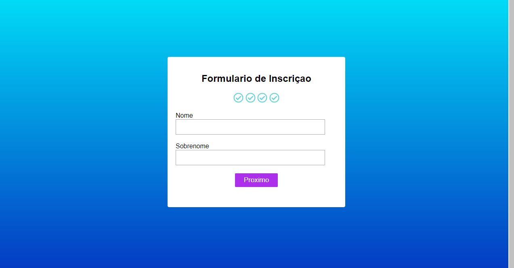

# form-mult-step
 Formulario com variais etapas

## 🗒 Sobre
Formulario de etapas simples.
Apenas para praticar javascrit.

## 🔨 Tecnologias:
- HHTML
- CSS
- JAVASCRIPT

## 📚 Requisitos:
- Nenhum

## 🏁 Como executar o projeto:
- Baixar ou clonar o repositorio
- Abrir o arquivo form.html no navegador
